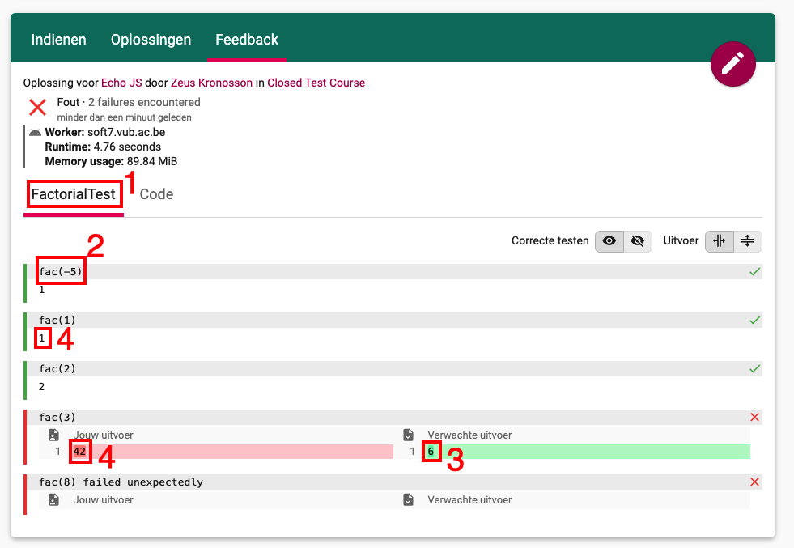

# Dodona C Judge
This is a Dodona judge for the C language. 

## Writing Tests
The C judge uses the [Google Test](https://github.com/google/googletest/blob/master/googletest/docs/primer.md) framework for writing C++ tests. Each exercise is verified via one or several test cases that are implemented using this framework.
This framework allows for generating JSON output to specify which test cases failed or passed. Once all tests have been completed, the JSON output is collected and parsed to provide the appropriate feedback to the students.
Test cases can employ any feature that is provided by Google Test, but they must generate a sensible JSON output that is understood by the output parser (cf. Section ["JSON output"](#json-output)).

Note that, although the C Judge relies on a C++ testing framework, the judge currently only supports evaluating C submissions. 

### Test Files
Every exercise directory should contain a header file which includes the relevant header files for writing the Google Tests, defines the `RECORD_TEST` macro (cf. Section ["Writing a Test Case"](#writing-a-test-case)), and declares the function(s) to be implemented by the student in this exercise. These functions should be declared as `extern "C"`.
`exercise_template_header.h` may serve as a template for such a header file. 

Apart from this and other potential header files, the exercise directory may contain several other kinds of files:
* Files ending in `.cpp`: Each file with this extension is considered to be a Google Test file and will be compiled to a **separate** test executable. Each `.cpp` file should include the aforementioned header file. These files will be compiled as C++11 code. The names of these files should **not** start with `aux_file_`.
* Files ending in `.c`: These files will be considered *auxiliary C files*, and may contain code that could be used by the student or by test cases. Once compiled, all corresponding object files will be linked together with the student's code and one individual test file. Auxiliary files will be compiled as C code, instead of C++ code. The file name `submission.c` cannot be used, as it is reserved for the student's submission.
* All other files will by default be ignored by the C Judge, although they may be read from or written to by the student's code.
* Subdirectories will be ignored entirely.

As noted above, each `.cpp` file will produce its own test executable. Test cases can therefore either be defined in one single source file, or spread out over multiple files. Implementing each test case in its own separate source file is cumbersome and significantly slows down the judge, but offers the following advantages:

* An unexpected failure in the student's code (e.g., because of a segfault), will cause the executable to immediately and non-recoverably terminate. If the executable only performs one test case, the other test cases can still continue.
* Handling exercises that use command-line arguments or the stdin stream is easier.  

It is recommended to write all test cases in one source file when writing tests for trivial exercises, where the student is unlikely to cause an unexpected failure (e.g., exercises that do not use pointers, I/O, memory allocation etc.) and to distribute each test case over their own source files for more complex exercises (e.g., any exercise where pointers have to be used), as well as exercises where the student has to use command-line arguments or read from the stdin stream.

### JSON Output

When a test case is run by the Google Test framework, its execution is recorded into a JSON output file. Google Test provides the  `::testing::Test::RecordProperty(string key, int|string value)` function to record `value` (which can be either a string or an integer) for key into the output. Every test case must record a value for the following properties:

* `description`: a string describing what the test case is testing. Corresponds with item 2 in Figure \ref{annotated_feedback}. Can be any string.

* `expected`: a string representation of the expected value returned by, or the expected property exhibited by, the student's code. Corresponds with item 3 in Figure \ref{annotated_feedback}. This string is only displayed if the test case failed. Can be any string.

* `actual`: the actual value produced by executing the student's code. Corresponds with item 4 in Figure \ref{annotated_feedback}. Can be either a string or an integer.  

### Writing a Test Case

It is recommended (though not required) to write tests using the `RECORD_TEST` macro, since this macro automatically records values for the `description` and `expected` properties (though not the property `actual`), and also takes care of unexpected failures when executing students' code.

The snippet below demonstrates how the `RECORD_TEST` macro is used to define a test case for checking one input of a factorial function.

```C
RECORD_TEST(FactorialTest, 2, "fac(1)", "1", {
  int actual = fac(1);
  RecordProperty("actual", actual);
  EXPECT_EQ(1, actual);
})
```

`RECORD_TEST` takes the following five arguments:

* `tab_name` (`FactorialTest` in the above example): the name of the tab in which the feedback will be displayed to the student. Corresponds with item 1 in Figure \ref{annotated_feedback}. As `tab_name` is mangled by GTest into (a part of) the name of an internal GTest function, `tab_name` should be a valid C++ identifier, and should not contain e.g. parentheses.

* `test_name` (`2`): a unique identifier for the test case executed. This identifier is never shown to the student. Similar to `tab_name` however, `test_name` is mangled into a part of the name of an internal GTest function, so the same naming restrictions as `tab_name` apply.

* `description` (`"fac(1)"`): the value recorded for the `description` property in the test output.

* `expected` (`"1"`): the value recorded for the `expected` property in the test output.

* `statement` (`{...}`): a statement (usually a block) to perform the actual test: execute the student's code (`int actual = fac(1)` in the example), check the return value or the exhibited property of the code (`EXPECT_EQ(1, actual);`), and use `RecordProperty("actual", ...);` to record the actual value/property produced.



### Configuring Exercises

Exercises can provide a configuration file to override some default compilation and linking mechanisms.
The configuration file must appear in the exercise's root directory, have the name `config.json`, and contain a JSON-formatted object.
The remainder of this sections lists all keys that are recognised by the C Judge. All of these keys are optional.

#### `"global_compiler_options"`

Specifies additional options used for the compilation of **all** source code files belonging to this exercise: unit-test files, the student's submission, and auxiliary source code files. The value of this key must be a string listing the compiler options. For example, `"global_compiler_options": "-o0 -g3"` makes the C Judge pass the options `-o0` and `-g3` when compiling any source code file.

####  `"file_compiler_options"`

Specifies additional options used for the compilation of **a specific source code file**. The value of this key must be a JSON object whose keys match the exact names of the source files you want to specify compilation options for. The options themselves must be provided as a single string. For example, when using
```JSON
"file_compiler_options": {
  "test_1.cpp": "-O0 -g3",
  "submission.c": "-D main=__submission_main__"
}
```
the `-O0 -g3` options will be used for compiling `test_1.cpp`, while the `-D main=__submitted_main` option will be used for compiling the student's `submission.c` file. Options that are defined for a specific file will completely replace the global compiler options (see above). The student's code file is represented as `submission.c`.

#### `"global_linker_options"`: Similar to `"global_compiler_options"`, but specifies additional options used for the linking of **all** final test executables. The value must be a string listing the linker options. For example, `"global_linker_options": "-L/some/dir -lsome_lib"` makes the C Judge pass the options `-L/some/dir` and `-lsome_lib` when linking.

#### `"file_linker_options"`

Similar to `"file_compiler_options"`, but specifies additional options used for linking of **specific object files**. Like `"file_compiler_options"`, the value must be a JSON object whose keys match the exact names of the **original source code files**. Example:
```JSON
"file_linker_options": {
  "test_1.cpp": "-lm",
  "test_2.cpp": "-L/some/dir -lsome_lib"
}
```
Options that are defined for a specific file will completely replace the global linker options (see above).

#### `"stdin"`

Specifies strings that will be piped to the stdin of a specific test case. This can be used to test submissions which rely on `scanf`, `getchar`. The value of this key must be a JSON object whose keys match the exact names of the **original source code files** of the test executables and whose values are strings representing the actual stdin contents. Example:
```JSON
"stdin_file": {
  "test_1.cpp": "this is stdin",
  "test_2.cpp": "some string\n123\n",
}
```

#### `"stdin_file"`

Similar to `"stdin"`, but instead of listing the values of stdin directly in the configuration file, this option lists the names of the files whose content will be piped to the stdin of a specific test case. The value for this key must be a JSON object whose keys match the exact names of the **original source code files** of the test executables. For example,
```JSON
"stdin_file": {
  "test_1.cpp": "stdin_for_test_1",
  "test_2.cpp": "stdin_for_test_2.txt",
}
```
will make the C Judge pipe the contents of file `stdin_for_test_1` to the test case executable `test_1`, and the contents of `stdin_for_test_2.txt` to executable `test_2`.
If a value is specified both for the `"stdin"` and the `"stdin_file"` of the same test file, only the value for `"stdin_file"` will be used. 

#### `"command_line_args"`

Specifies the command-line arguments to be supplied to specific test executables. This can be used to test submissions where students have to use the program's command-line arguments. The value of this keys must be a JSON object whose keys match the exact names of the **original source code files** of the test executables and whose values are strings representing the command-line arguments. Example:
```JSON
"command_line_args": {
  "test_1.cpp": "arg1 arg2 arg3",
  "test_2.cpp": "arg1"
}
```

### Shadowing `main`

While compiling the student's submission file, a macro is automatically inserted to replace any occurrence of the identifier `main` with `__submission_main__`.
If an exercise calls for the student to define their own `main`-function, test cases must call `__submission_main__` to execute the student's implementation.
Note that this function must still be declared by the test case.

### Compilation, Linking, and Execution Commands

Below are the complete commands that are used to compile and link the various files mentioned in this document, as well as the command for running the test executables:

* Compiling the student's submission file (which will be renamed `submission.c`): `g++ -x c -c [file_or_global_compiler_options] -D main=__submission_main__ submission.c -o submission.o`

* Compiling auxiliary C files: `g++ -x c -c [file_or_global_compiler_options] file_name.c -o "aux_file_file_name.o"`

* Compiling test files: `g++ -std=c++11 -c [file_or_global_compiler_options] "test_file_1.cpp" -o "test_file_1.o"`

* Linking all files: `g++ aux_file_*.o submission.o "test_file_1.o" -o output [file_or_global_compiler_options] -lgtest -lgtest_main -pthread`

* Executing a test case: `echo [stdin_content] | ./output "--gtest_output=json:$(pwd)/gtest_output" [command-line_args]`

## Example Exercises
The `example_exercises` folder contains several example exercise directories, as well as sample solutions, to demonstrate how the C Judge can be used to write tests for a variety of exercises:

* `fact_single`: A simple test file for testing the `fac` function implemented by the student. Defines eight test cases for this function.

* `fact_many`: Identical to `wpo1_ex_fact_single`, but with the eight test cases spread out over individual test files.

* `fact_config`: Shows how to use compilation and linking options. See [configuration options `"global_compiler_options"`](#global_compiler_options) to [`"file_linker_options"`](#file_linker_options).

* `count_c`: Demonstrates how tests can be written for student-defined functions that read from files.

* `binary_tree`: An exercise containing an auxiliary C file implementing a binary tree structure, where students have to write code that relies on this implementation.

* `command_line_args`: Test an exercise where students must define a `main` function and use command-line arguments. See [configuration option `"command_line_args"`](#command_line_args).

* `stdin`: Demonstrates how to write tests for exercises where students must read from stdin. See [configuration option `"stdin"`](#stdin).

* `stdin_files`: Identical to `wpo1_ex_stdin`, but with the stdin specified in files instead of in the config file itself. See [configuration option `"stdin_file"`](#stdin_file).

* `stdout`: Shows how Google Test can be used to test what is written to stdout.

## Testing
Some automated system tests for verying the backward-correctness of the judge have been provided in the `tests` folder. They can be run by executing the `autotest.sh` script. These tests simply run the judge on fixed tests and submissions files, capture its output, and compare this output with a predefined string. 
